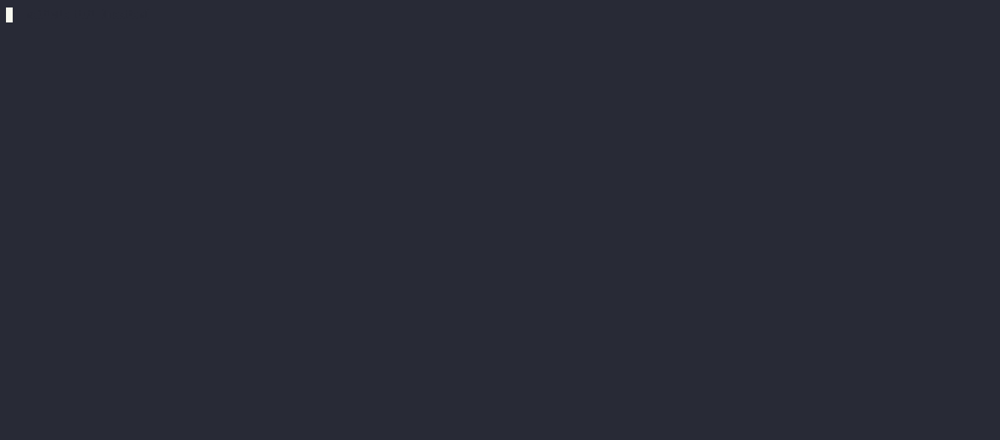

# radicle-tui



`radicle-tui` provides various terminal user interfaces for interacting with the [Radicle](https://radicle.xyz) code forge and exposes the application framework they were built with.

## Binaries

This crate provides a single binary called `rad-tui` which contains all user interfaces. Specific interfaces can be run by the appropriate command, e.g. `rad-tui patch select` shows a patch selector.

The interfaces are designed to be modular and to integrate well with the existing Radicle CLI. Right now, they are meant to be called from other programs that will collect and process their output.

### Installation

**Requirements**

- _Linux_ or _Unix_ based operating system.
- Git 2.34 or later
- OpenSSH 9.1 or later with `ssh-agent`

#### From source

> Requires the Rust toolchain.

You can install the binary from source, by running the following
commands from inside this repository:

```
cargo install --path . --force --locked
```

Or directly from our seed node:

```
cargo install --force --locked --git https://seed.radicle.xyz/z39mP9rQAaGmERfUMPULfPUi473tY.git
```

This will install `rad-tui`. You can execute it by running `rad-tui`. All available commands can be shown by running `rad-tui --help`.

### Usage

Select a patch, an issue or a notification and an operation:

```
$ rad-tui <patch | issue | inbox> select
```
Same as above:

```
$ rad-tui <patch | issue | inbox> select --mode operation
```

Select a patch, an issue or a notification only and return its id:

```
$ rad-tui <patch | issue | inbox> select --mode id
```

### Output

All interfaces return a JSON object that reflects the choices made by the user, e.g.: 

```
{ "operation": "show", "ids": ["546443226b300484a97a2b2d7c7000af6e8169ba"], args:[] }
```

## Framework

The library portion of this crate is a framework that is the foundation for the interfaces mentioned above. The framework is built on top of [ratatui](https://ratatui.rs) and was inspired by the Flux application pattern. It took some ideas from [cursive](https://github.com/gyscos/cursive) and [rust-chat-server](https://github.com/Yengas/rust-chat-server).

### Example

```rust
use anyhow::Result;

use termion::event::Key;

use ratatui::text::Text;

use radicle_tui as tui;

use tui::store;
use tui::ui::widget::text::{TextArea, TextAreaProps};
use tui::ui::widget::ToWidget;
use tui::{BoxedAny, Channel, Exit};

#[derive(Clone, Debug)]
struct State {
    hello: String,
}

enum Message {
    Quit,
}

impl store::State<()> for State {
    type Message = Message;

    fn update(&mut self, message: Self::Message) -> Option<tui::Exit<()>> {
        match message {
            Message::Quit => Some(Exit { value: None }),
        }
    }

    fn tick(&mut self) {}
}

#[tokio::main]
pub async fn main() -> Result<()> {
    let channel = Channel::default();
    let sender = channel.tx.clone();
    let state = State {
        hello: "Hey there, press (q) to quit...".to_string(),
    };

    let scene = TextArea::default()
        .to_widget(sender.clone())
        .on_event(|key, _, _| match key {
            Key::Char('q') => Some(Message::Quit),
            _ => None,
        })
        .on_update(|state: &State| {
            TextAreaProps::default()
                .text(&Text::raw(state.hello.clone()))
                .to_boxed_any()
                .into()
        });

    tui::run(channel, state, scene).await?;

    Ok(())
}
```


## License

`radicle-tui` is distributed under the terms of both the MIT license and the Apache License (Version 2.0).

See [LICENSE-APACHE](LICENSE-APACHE) and [LICENSE-MIT](LICENSE-MIT) for details.
